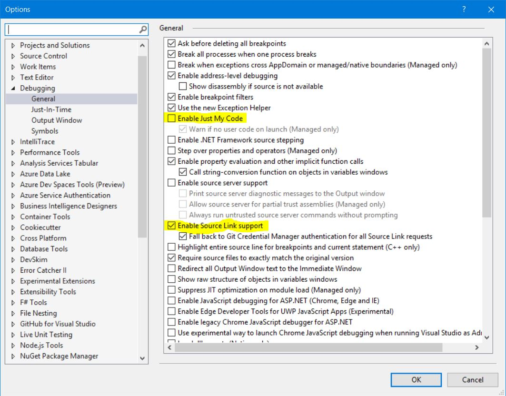

Change Log
===============================================================================

Version 3.0.0

* Removed ScheduledJob class
* Removed properties from IScheduledJob (CronSchedule, CronTimeZone, RunImmediately)
* Simplify registration for the jobs and options.
* Allow for the same job type to be registered with different cron schedule options.
* Jobs options are refreshed if the configuration provider notifies of the changes.

Version 2.1.0

* Introduced the ability to register schedule jobs at any point of time not only at the startup.
* Introduced the `SchedulerOptions` mechanism to update the options on configuration provider reload.

Version 1.1.2

* Resolved issue #22 "schedule executing twice per day instead of once"
* Resolved issue #23 "Updating CronScheduler with .NET Core Workers Template"

Version 1.0.9 (2019-02-18)

* Resolved issue #8 "Add Background Task Queue Functionality".
* Removed `HostedServiceBase` class in favor of built-in `BackgroundService` class.

Version 1.0.7 (2018-01-16)
* Resolved issue #5 "Add support for SourceLink", to make use of this feature in Visual Studio.NET please deselect `Enable Just My Code` and select `Enable Source Link support` as shown per this image:


* Resovled issue #6 "Add support for kdcllc Docker image". 

* Resolved issue #4 "Add support for seconds with Cron".

* Resolved issue #7 "Add support for async Statup.cs job".

```c#
   public string CronTimeZone { get; };

```

Version 1.0.5 (2018-03-12)
----------------------------
 * Resolved issue#1 "Add option to not run job on application start"
 * Resolved issue#2 "Add option to disable job"
 * Add new Extension method that allows adding of the depended jobs:
    ```c#
        services.AddScheduler(builder =>
        {
            // recommended to use TryAddSingleton
            builder.Services.TryAddSingleton<IScheduledJob, TorahQuoteJob>();
            builder.UnobservedTaskExceptionHandler = UnobservedHandler;
        });
    ```
 * Add functional tests.

Version 1.0.4
----------------------------
 * Intial design
